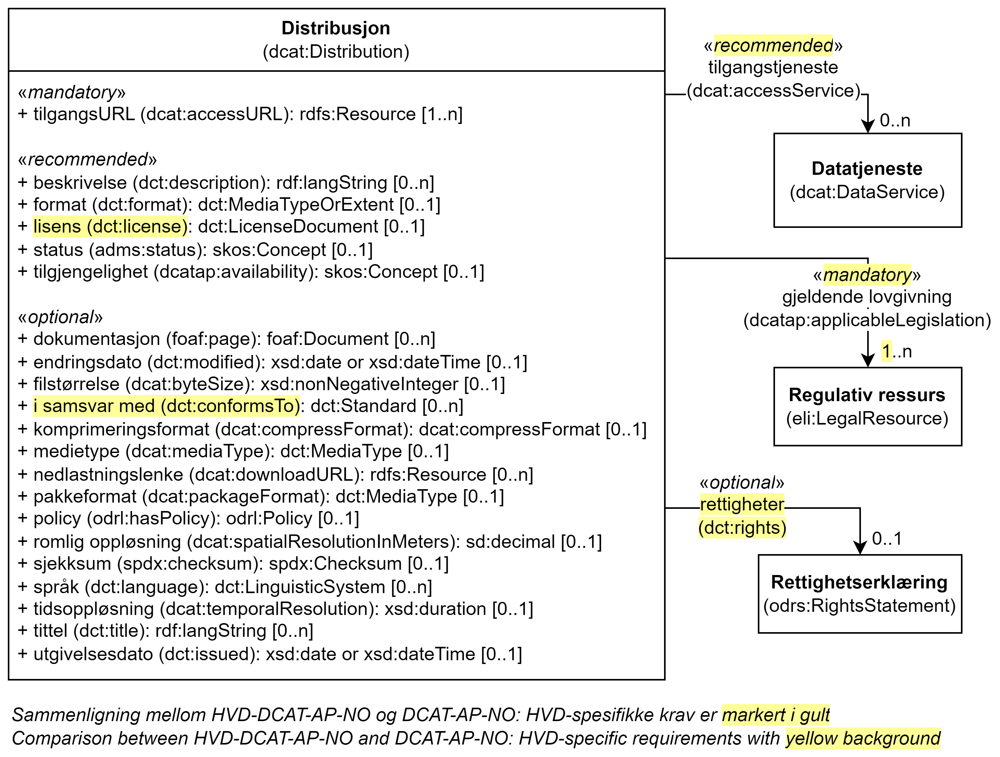

= Klassen Distribusjon (dcat:Distribution) [[Distribusjon]]

:xrefstyle: short

<<diagram-Klassen-Distribusjon>> viser klassen Distribusjon og dens egenskaper, samt klassene den refererer til. I figuren er differansen mellom kravene i HVD-DCAT-AP-NO og DCAT-AP-NO markert i gult. Kun kravene som er spesifikke for HVD er videre spesifisert i dette kapittelet. Kravene ellers til https://informasjonsforvaltning.github.io/dcat-ap-no/#Distribusjon[klassen Distribusjon (dcat:Distribution) i DCAT-AP-NO &#x29C9;, window="_blank", role="ext-link"] gjelder også for denne klassen. 

[[diagram-Klassen-Distribusjon]]
.Klassen Distribusjon og klassene den refererer til.
[link=images/Klassen-Distribusjon.png]

:xrefstyle: full

[cols="30s,70d"]
|===
| _English name_ | _Distribution_
| URI | dcat:Distribution
| Anvendelse / _Usage note_ | Klassen brukes til å representere en fysisk representasjon av datasettet i et bestemt format.

_This class is used to represent a distribution, i.e., a physical embodiment of the Dataset in a particular format._
| Merknad / _Note_ | Bulknedlastinger skal beskrives som distribusjon. 

__Bulk downloads should be encoded as a Distribution.__
|===

== Obligatoriske egenskaper for klassen _Distribusjon_ [[Distribusjon-obligatoriske-egenskaper]]

=== Distribusjon – gjeldende lovgivning (dcatap:applicableLegislation) [[Distribusjon-gjeldendeLovgivning]]

[cols="30s,70"]
|===
| _English name_ | _applicable legislation_
| URI | dcatap:applicableLegislation
| Verdiområde / _Range_ | https://informasjonsforvaltning.github.io/dcat-ap-no/#RegulativRessurs[eli:LegalResource &#x29C9;, window="_blank", role="ext-link"]
| Anvendelse / _Usage note_ | Egenskapen brukes til å referere til lovgivningen som gir mandat til opprettelse eller forvaltning av distribusjonen.

_This property is used to refer to the legislation that mandates the creation or management of the Distribution._
| Multiplisitet / _Multiplicity_ | 1..n
| Kravnivå / _Requirement level_ | Obligatorisk / _Mandatory_
| Merknad / _Note_ | For HVD SKAL en av verdiene være http://data.europa.eu/eli/reg_impl/2023/138/oj.

__For HVD the value MUST include the ELI http://data.europa.eu/eli/reg_impl/2023/138/oj.__
|===

== Anbefalte egenskaper for klassen _Distribusjon_ [[Distribusjon-anbefalte-egenskaper]]

=== Distribusjon – lisens (dct:license) [[Distribusjon-lisens]]

[cols="30s,70d"]
|===
| _English name_ | _licence_
| URI | dct:license
| Verdiområde / _Range_ | dct:LicenseDocument
| Anvendelse / _Usage note_ | Egenskapen brukes til å referere til lisensen som distribusjonen er gjort tilgjengelig under.

_This property is used to refer to a licence under which the Distribution is made available._
| Multiplisitet / _Multiplicity_ | 0..1
| Kravnivå / _Requirement level_ | Anbefalt / _Recommended_
| Merknad / _Note_ | Artikkel 4.3. i HVD-forordningen spesifiserer at HVD bør gjøres tilgjengelig for viderebruk. Som beskrevet under <<Spesielt_om_juridisk_info>> kan kravet oppfylles ved å referere til en lisens. Egenskapen <<Distribusjon-rettigheter>> kan brukes som et alternativ. 

__Article 4.3 specifies that High-value datasets should be made available for reuse. According to the guidelines under <<Spesielt_om_juridisk_info>> (in Norwegian only) this is fulfilled by referencing to a licence. As alternative the property <<Distribusjon-rettigheter>> can be used.__
|===

== Valgfrie egenskaper for klassen _Distribusjon_ [[Distribusjon-valgfrie-egenskaper]]

=== Distribusjon – i samsvar med (dct:conformsTo) [[Distribusjon-i-samsvar-med]]

[cols="30s,70d"]
|===
| _English name_ | _linked schemas_
| URI | dct:conformsTo
| Verdiområde / _Range_ | https://informasjonsforvaltning.github.io/dcat-ap-no/#Standard[dct:Standard &#x29C9;, window="_blank", role="ext-link"]
| Anvendelse / _Usage note_ | Egenskapen brukes til å referere til et etablert skjema som distribusjonen er i samsvar med.

_This property is used to refer to an established schema to which the described Distribution conforms._
| Multiplisitet / _Multiplicity_ | 0..n
| Kravnivå / _Requirement level_ | Valgfri / _Optional_
| Merknad / _Note_ | Informasjonen som oppgis her bør gjøre det mulig å verifisere om detaljerte krav til den aktuelle kategori av HVD er tilfredsstilt. Se <<Spesifikke_datakrav>>. 

__The provided information should enable to the verification whether the detailed information requirements by the HVD is satisfied. See <<Spesifikke_datakrav>> (in Norwegian only).__
|===

=== Distribusjon – rettigheter (dct:rights) [[Distribusjon-rettigheter]]

[cols="30s,70d"]
|===
| _English name_ | _rights_
| URI | dct:rights
| Verdiområde / _Range_ | https://informasjonsforvaltning.github.io/dcat-ap-no/#Rettighetserkl%C3%A6ring[odrs:RightsStatement &#x29C9;, window="_blank", role="ext-link"]
| Anvendelse / _Usage note_ | Egenskapen brukes til å referere til en uttalelse som angir rettigheter knyttet til distribusjonen.

_This property is used to refer to a statement that specifies rights associated with the Distribution._
| Multiplisitet / _Multiplicity_ | 0..1 #@@@@@@ NB! Sjekk hva EU lander på her#
| Kravnivå / _Requirement level_ | Valgfri / _Optional_
| Merknad / _Note_ | Artikkel 4.3. i HVD-forordningen spesifiserer at HVD bør gjøres tilgjengelig for viderebruk. Som beskrevet under <<Spesielt_om_juridisk_info>> kan kravet oppfylles ved å referere til en lisens. Denne egenskapen kan brukes som et alternativ. 

__Article 4.3 specifies that High-value datasets should be made available for reuse. According to the guidelines under <<Spesielt_om_juridisk_info>> (in Norwegian only) this is fulfilled by referencing to a licence using the property <<Distribusjon-lisens>>. This property can be used as an alternative.__
|===

