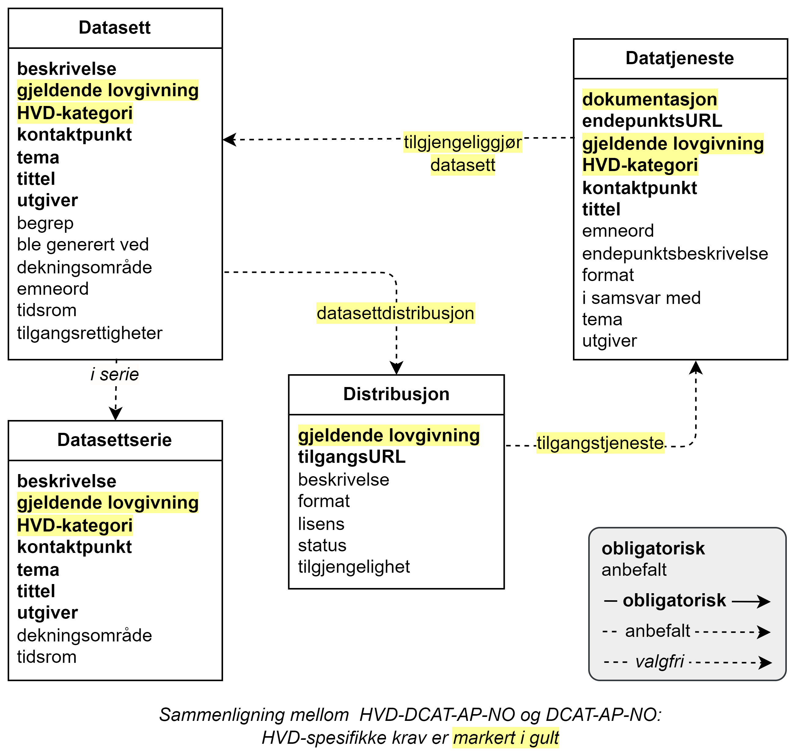

= Forenklet fremstilling av kravene i HVD-DCAT-AP-NO [[Forenklet-fremstilling-av-kravene]]

Denne standarden inneholder kun HVD-spesifikke krav. Kravene ellers i DCAT-AP-NO gjelder også for HVD. Denne standarden skal derfor brukes sammen med, og ikke istedenfor, DCAT-AP-NO.

== HVD-spesifikke krav

:xrefstyle: short

<> viser en forenklet fremstilling av kravene i HVD-DCAT-AP-NO. Den viser kun de klassene som er spesifisert i denne standarden, dessuten med kun obligatoriske og anbefalte krav. HVD-DCAT-AP-NO skal brukes sammen med DCAT-AP-NO, ettersom den supplerer DCAT-AP-NO. HVD-spesifikke krav er markert i gult i tegningen. 

Tegningen er ikke ment som en formell representasjon av standarden, men kun for å gi en visuell oversikt over noen av klassene og relasjoner mellom dem. Tekniske krav til hvordan klassene og de __HVD-spesifikke__ egenskapene/relasjoner skal uttrykkes i RDF er spesifisert videre i standarden. Før eventuell uoverensstemmelse mellom tegningen og den tekstlige spesifikasjonen blir rettet opp, har den tekstlige spesifikasjonen av klassene/egenskapene forrang. Samme forrang gjelder også når det gjelder eventuelle uoverensstemmelser mellom tekstlige spesifikasjoner og tegninger i resten av standarden. 

[[img-ForenkletModell]]
.Forenklet fremstilling av kravene i HVD-DCAT-AP-NO, med kun obligatoriske og anbefalte krav.
[link=images/HVD-DCAT-AP-NO-forenklet-fremstilling.png]

:xrefstyle: full

I tillegg til de ikke-HVD-spesifikke obligatoriske kravene i DCAT-AP-NO som ikke gjentas i denne standarden, illustrerer figuren bl.a. følgende  obligatoriske krav som er HVD-spesifikke: 

* Et **datasett** med høy verdi SKAL gjøres tilgjengelig. Se HVD-forordningen om det aktuelle datasettet skal gjøres tilgjengelig både via API (**datatjeneste**) og som bulknedlasting (**distribusjon**), eller en av de to måtene. 

* **Datasett** med høy verdi og relaterte **distribusjon**er og APIer (**datatjeneste**r) SKAL oppgi http://data.europa.eu/eli/reg_impl/2023/138/oj[HVD-forordningen &#x29C9;, window="_blank", role="ext-link"] som *gjeldende lovgivning*.  

* Det SKAL oppgis *HVD-kategori*(er) et **datasett** med høy verdi tilhører. Samme krav gjelder også APIer (**datatjeneste**r) som tilgjengeliggjør datasett med høy verdi. https://op.europa.eu/en/web/eu-vocabularies/dataset/-/resource?uri=http://publications.europa.eu/resource/dataset/high-value-dataset-category[EUs kontrollerte vokabular for HVD-kategorier &#x29C9;, window="_blank", role="ext-link"] SKAL brukes. 

* Et API (en **datatjeneste**) som tilgjengeliggjør datasett med høy verdi, SKAL ha **dokumentasjon** som beskriver bl.a. tjenestekvalitet. 

== Eksempel på et HVD

Eksemplet her er basert på datasettet https://data.norge.no/datasets/9b8fbdd7-7294-39e2-959b-24dc8ab0df4a[«Virksomhetsinformasjon - i henhold til STIRDatas modell» beskrevet i Felles datakatalog (data.norge.no) &#x29C9;, window="_blank", role="ext-link"]. Eksemplet har kun som hensikt å illustrere bruken av standarden, og gjenspeiler ikke nødvendigvis virkeligheten. Eksemplet er heller ikke komplett. Det inneholder kun noen av de opplysningene som det stilles krav til i denne standarden. Minimumsopplysninger er **uthevet**.

* **gjeldende lovgivning**: HVD-forordningen (\http://data.europa.eu/eli/reg_impl/2023/138/oj )
* **HVD-kategori**: selskaps- og eierskapsdata (\http://data.europa.eu/bna/c_a9135398)
* i samsvar med: STIRData business data model (\https://stirdata.github.io/data-specification/) 
* **datasettdistribusjon (bulknedlasting)**: 
** **gjeldende lovgivning**: HVD-forordningen (\http://data.europa.eu/eli/reg_impl/2023/138/oj)
** lisens: CC BY 4.0 (\http://publications.europa.eu/resource/authority/licence/CC_BY_4_0)
** i samsvar med: STIRData business data model (\https://stirdata.github.io/data-specification/)
* **datatjeneste (API)**:
** **dokumentasjon**: Enhetsregisterets dokumentasjon for åpne data (\https://data.brreg.no/enhetsregisteret/api/dokumentasjon/) 
** **gjeldende lovgivning**: HVD-forordningen (\http://data.europa.eu/eli/reg_impl/2023/138/oj)
** **HVD-kategori**: selskaps- og eierskapsdata (\http://data.europa.eu/bna/c_a9135398)
** lisens: CC BY 4.0 (\http://publications.europa.eu/resource/authority/licence/CC_BY_4_0)

