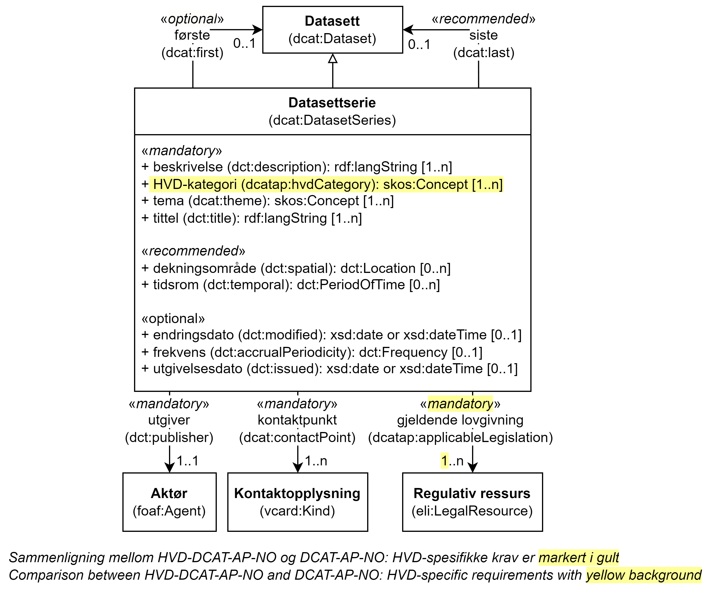

= Klassen Datasettserie (dcat:DatasetSeries) [[Datasettserie]]

:xrefstyle: short

<<diagram-Klassen-Datasettserie>> viser klassen Datasettserie og dens egenskaper, samt klassene den refererer til. I figuren er differansen mellom kravene i HVD-DCAT-AP-NO og DCAT-AP-NO markert i gult. Kun kravene som er spesifikke for HVD er videre spesifisert i dette kapittelet. Kravene ellers til https://data.norge.no/specification/dcat-ap-no/#Datasettserie[klassen Datasettserie (dcat:DatasetSeries) i DCAT-AP-NO &#x29C9;, window="_blank", role="ext-link"] gjelder også for denne klassen. Se også https://data.norge.no/specification/dcat-ap-no/#Om-Datasettserie[Om bruk av datasettserie i DCAT-AP-NO &#x29C9;, window="_blank", role="ext-link"].

[[diagram-Klassen-Datasettserie]]
.Klassen Datasettserie og klassene den refererer til.
[link=images/Klassen-Datasettserie.png]

:xrefstyle: full

[cols="30s,70"]
|===
| _English name_ | _Dataset series_
| URI | dcat:DatasetSerie
| Subklasse av / _Subclass of_ | <<Datasett, dcat:Dataset>>
| Anvendelse / _Usage note_ | Klassen brukes til å representere en samling av datasett som publiseres separat, men som deler noen felles egenskaper som gjør at de er gruppert sammen. 

_This class is used to represent a collection of datasets that are published separately, but share some characteristics that group them._
|===

== Obligatoriske egenskaper for klassen _Datasettserie_ [[Datasettserie-obligatoriske-egenskaper]]
 

=== Datasettserie – gjeldende lovgivning (dcatap:applicableLegislation) [[Datasettserie-gjeldendeLovgivning]]

[cols="30s,70"]
|===
| _English name_ | _applicable legislation_
| URI | dcatap:applicableLegislation
| Verdiområde / _Range_ | https://data.norge.no/specification/dcat-ap-no/#RegulativRessurs[eli:LegalResource &#x29C9;, window="_blank", role="ext-link"]
| Anvendelse / _Usage note_ | Egenskapen brukes til å referere til lovgivningen som gir mandat til opprettelse eller behandling av datasettserien.

_This property is used to refer to the legislation that mandates the creation or management of the dataset series._
| Multiplisitet / _Multiplicity_ | 1..n
| Kravnivå / _Requirement level_ | Obligatorisk / _Mandatory_
| Merknad / _Note_ | For HVD SKAL en av verdiene være `\http://data.europa.eu/eli/reg_impl/2023/138/oj`.

__For HVD the value MUST include the ELI `\http://data.europa.eu/eli/reg_impl/2023/138/oj`.__
|===

Eksempel i RDF Turtle:
-----
<aDatasetSeries> a dcat:DatasetSeries ; 
   dcatap:applicableLegislation <http://data.europa.eu/eli/reg_impl/2023/138/oj> ; .
-----

=== Datasettserie – HVD-kategori (dcatap:hvdCategory) [[Datasettserie-hvdKategori]]

[cols="30s,70"]
|===
| _English name_ | _HVD category_
| URI | dcatap:hvdCategory
| Verdiområde / _Range_ | skos:Concept
| Anvendelse / _Usage note_ | Egenskapen brukes til å referere til HVD kategorien som dette datasettserien tilhører. 

__This property is used to refer to HVD category to which this dataset series belongs.__
| Multiplisitet / _Multiplicity_ | 1..n
| Kravnivå / _Requirement level_ | Obligatorisk / _Mandatory_
| Merknad / _Note_ | Verdien SKAL hentes fra EUs kontrollerte vokabular https://op.europa.eu/en/web/eu-vocabularies/concept-scheme/-/resource?uri=http://data.europa.eu/bna/asd487ae75[High-value dataset categories  &#x29C9;, window="_blank", role="ext-link"]. 

__The value MUST be chosen from EU's controlled vocabulary https://op.europa.eu/en/web/eu-vocabularies/concept-scheme/-/resource?uri=http://data.europa.eu/bna/asd487ae75[High-value dataset categories  &#x29C9;, window="_blank", role="ext-link"].__
|===

Eksempel i RDF Turtle:
-----
<aDatasetSeries> a dcat:DatasetSeries ; 
   dcatap:hvdCategory <http://data.europa.eu/bna/c_a9135398> ; .
-----
