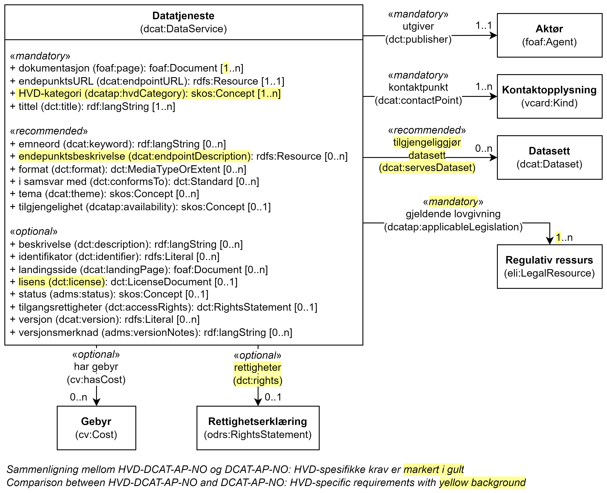

= Klassen Datatjeneste (dcat:DataService) [[Datatjeneste]]

:xrefstyle: short

<<diagram-Klassen-Datatjeneste>> viser klassen Datatjeneste og dens egenskaper, samt klassene den refererer til. I figuren er differansen mellom kravene i HVD-DCAT-AP-NO og DCAT-AP-NO markert gult. Kun kravene som er spesifikke for HVD er videre spesifisert i dette kapittelet. Kravene ellers til https://informasjonsforvaltning.github.io/dcat-ap-no/#Datatjeneste[klassen Datatjeneste (dcat:DataService) i DCAT-AP-NO &#x29C9;, window="_blank", role="ext-link"] gjelder også for denne klassen.

[[diagram-Klassen-Datatjeneste]]
.Klassen Datatjeneste og klassene den refererer til.
[link=images/Klassen-Datatjeneste.png]

:xrefstyle: full

[cols="30s,70d"]
|===
| _English name_ | _Data service_
| URI | dcat:DataService
| Subklasse av / _Subclass of_ | dcat:Resource
| Beskrivelse | Klassen brukes til å representere en datatjeneste, dvs. en samling av operasjoner som gir tilgang til ett eller flere datasett eller databehandlingsfunksjoner.

_This class is used to represent a data service, i.e., a collection of operations that provides access to one or more datasets or data processing functions._
|===

== Obligatoriske egenskaper for klassen _Datatjeneste_ [[Datatjeneste-obligatoriske-egenskaper]]

=== Datatjeneste – dokumentasjon (foaf:page) [[Datatjeneste-dokumentasjon]]
[cols="30s,70d"]
|===
| _English name_ | _documentation_
| URI | foaf:page
| Verdiområde / _Range_ | foaf:Document
| Anvendelse / _Usage note_ | Egenskapen brukes til å referere til en side eller et dokument som beskriver datatjenesten.

_This property is used to refer to a page or a document that describes the data service._
| Multiplisitet / _Multiplicity_ | 1..n
| Kravnivå / _Requirement level_ | Obligatorisk / _Mandatory_
| Merknad / _Note_ | Kvalitet på tjeneste er betraktet som en del av den generiske dokumentasjonen av en datatjeneste. 

__Quality of service covers a broad spectrum of aspects. The HVD regulation does not list any mandatory topic. Therefore quality of service information is considered part of the generic documentation of a Data Service.__
|===

=== Datatjeneste – endepunktsURL (dcat:endpointURL) [[Datatjeneste-endepunktsurl]]

[cols="30s,70d"]
|===
| _English name_ | _endpoint URL_
| URI | dcat:endpointURL
| Verdiområde / _Range_ | rdfs:Resource
| Anvendelse / _Usage note_ | Egenskapen brukes til å referere til rotplassering eller primært endepunkt for tjenesten (en URI).

_This property is used to refer to the root location or primary endpoint of the service (an IRI)._
| Multiplisitet / _Multiplicity_ | 1..1
| Kravnivå / _Requirement level_ | Obligatorisk / _Mandatory_
| Merknad / _Note_ | EndepunktsURLen BØR være persistent. Utgiveren bør derfor holde den vedlike og stabil.  

__The endpoint URL SHOULD be persistent. This means that publishers should do everything in their power to maintain the value stable and existing.__
|===

=== Datatjeneste – gjeldende lovgivning (dcatap:applicableLegislation) [[Datatjeneste-gjeldendeLovgivning]]

[cols="30s,70"]
|===
| _English name_ | _applicable legislation_
| URI | dcatap:applicableLegislation
| Verdiområde / _Range_ | eli:LegalResource
| Anvendelse / _Usage note_ | Egenskapen brukes til å referere til lovgivningen som gir mandat til opprettelse eller forvaltning av datatjenesten.

_This property is used to refer to the legislation that mandates the creation or management of the Data Service._
| Multiplisitet / _Multiplicity_ | 1..n
| Kravnivå / _Requirement level_ | Obligatorisk / _Mandatory_
| Merknad / _Note_ | For HVD SKAL en av verdiene være http://data.europa.eu/eli/reg_impl/2023/138/oj.

__For HVD the value MUST include the ELI http://data.europa.eu/eli/reg_impl/2023/138/oj.__
|===

=== Datatjeneste – HVD-kategori (dcatap:hvdCategory) [[Datatjeneste-gjeldendeLovgivning]]

[cols="30s,70"]
|===
| _English name_ | _HVD category_
| URI | dcatap:hvdCategory
| Verdiområde / _Range_ | skos:Concept
| Anvendelse / _Usage note_ | Egenskapen brukes til å referere til HVD kategorien som denne datatjeneste tilhører. 

_This property is used to refer to HVD category to which this Data Service belongs._
| Multiplisitet / _Multiplicity_ | 1..n
| Kravnivå / _Requirement level_ | Obligatorisk / _Mandatory_
| Merknad / _Note_ | Verdien SKAL hentes fra EUs kontrollerte vokabular  https://op.europa.eu/en/web/eu-vocabularies/dataset/-/resource?uri=http://publications.europa.eu/resource/dataset/high-value-dataset-category[High-value dataset categories  &#x29C9;, window="_blank", role="ext-link"]. 

__The value MUST be chosen from EU's controlled vocabulary https://op.europa.eu/en/web/eu-vocabularies/dataset/-/resource?uri=http://publications.europa.eu/resource/dataset/high-value-dataset-category[High-value dataset categories  &#x29C9;, window="_blank", role="ext-link"].__
|===

=== Datatjeneste – kontaktpunkt (dcat:contactPoint) [[Datatjeneste-kontaktpunkt]]

[cols="30s,70d"]
|===
| _English name_ | _contact point_
| URI | dcat:contactPoint
| Verdiområde / _Range_ | vcard:Kind
| Anvendelse / _Usage note_ | Egenskapen brukes til å referere til kontaktpunkt med kontaktopplysninger. Disse kan brukes til å sende kommentarer om datatjenesten.

_This property is used to specify contact information that can be used for sending comments about the Data Service._
| Multiplisitet / _Multiplicity_ | 1..n
| Kravnivå / _Requirement level_ | Obligatorisk / _Mandatory_
| Merknad / _Note_ | Denne egenskapen er obligatorisk i DCAT-AP-NO allerede. Artikkel 3.4 i HVD-forordningen krever at kontaktpunkt skal oppgis for API. 

__Article 3.4 in HVD IR requires the designation of a point of contact for an API.__
|===

== Anbefalte egenskaper for klassen _Datatjeneste_ [[Datatjeneste-anbefalte-egenskaper]]

=== Datatjeneste – endepunktsbeskrivelse (dcat:endpointDescription) [[Datatjeneste-endepunktsbeskrivelse]]

[cols="30s,70d"]
|===
| _English name_ | _endpoint description_
| URI | dcat:endpointDescription
| Verdiområde / _Range_ | rdfs:Resource
| Anvendelse / _Usage note_ | Egenskapen brukes til å oppgi en beskrivelse av tjenestene som er tilgjengelige via endepunktene, inkludert deres operasjoner, parametere osv. Egenskapen gir spesifikke detaljer om de faktiske endepunkt-instansene, mens egenskapen https://informasjonsforvaltning.github.io/dcat-ap-no/#Datatjeneste-i-samsvar-med[Datatjeneste – i samsvar med (dct:conformsTo) &#x29C9;, window="_blank", role="ext-link"] brukes til å indikere den generelle standarden eller spesifikasjonen som endepunktene implementerer.

__The property is used to provide specific details of the actual endpoint instances, while dct:conformsTo is used to indicate the general standard or specification that the endpoints implement.__
| Multiplisitet / _Multiplicity_ | 0..n
| Kravnivå / _Requirement level_ | Anbefalt / _Recommended_
| Merknad / _Note_ | Artikkel 3.3 i HVD-forordningen krever API-dokumentasjon i et EU- eller internasjonalt anerkjent og åpent, menneske- og maskinlesbart format.

__Article 3.3 in HVD IR requires to provide API documentation in a Union or internationally recognised open, human-readable and machine-readable format.__
|===

=== Datatjeneste – tilgjengeliggjør datasett (dcat:servesDataset) [[Datatjeneste-tilgjengeliggjor-datasett]]

[cols="30s,70d"]
|===
| _English name_ | _serves dataset_
| URI | dcat:servesDataset
| Verdiområde / _Range_ | dcat:Dataset
| Anvendelse / _Usage note_ | Egenskapen brukes til å referere til datasett som datatjenesten kan distribuere.

_This property is used to refer to a collection of data that this data service can distribute._
| Multiplisitet / _Multiplicity_ | 0..n
| Kravnivå / _Requirement level_ | Anbefalt / _Recommended_
| Merknad / _Note_ | Selv om denne egenskapen er anbefalt og ikke obligatorisk, SKAL en datatjeneste i en HVD-katalog brukes til å gi tilgang til HVD-datasett. Se også <<Spesielt_om_distribusjoner_datatjenester>>. 

__Although this property is recommended and not mandatory, a Data service that is included in the HVD catalog MUST provide access to at least one HVD marked dataset. See  <<Spesielt_om_distribusjoner_datatjenester>> which is in Norwegian only.__
|===

== Valgfrie egenskaper for klassen _Datatjeneste_ [[Datatjeneste-valgfrie-egenskaper]]

=== Datatjeneste – lisens (dct:license) [[Datatjeneste-lisens]]
[cols="30s,70d"]
|===
| _English name_ | _licence_
| URI | dct:license
| Verdiområde / _Range_ | dct:LicenseDocument
| Anvendelse / _Usage note_ | Egenskapen brukes til å referere til lisensen som datatjenesten blir gjort tilgjengelig under.

_This property is used to refer to a licence under which the data service is made available._
| Multiplisitet / _Multiplicity_ | 0..1
| Kravnivå / _Requirement level_ | Valgfri / _Optional_
| Merknad / _Note_ | Artikkel 2.2. i HVD-forordningen spesifiserer at brukervilkår bør oppgis. Som beskrevet under <<Spesielt_om_juridisk_info>> kan kravet tilfredsstilles ved å referere til en lisens. Egenskapen <<Datatjeneste-rettigheter>> kan brukes som et alternativ. 

__Article 3.3 in HVD IR specifies that the terms of use should be provided. According to the guidelines under <<Spesielt_om_juridisk_info>> (in Norwegian only) this is fulfilled by referencing to a licence. As alternative the property dct:rights can be used.__
|===

=== Datatjeneste – rettigheter (dct:rights) [[Datatjeneste-rettigheter]]

[cols="30s,70d"]
|===
| _English name_ | _rights_
| URI | dct:rights
| Verdiområde / _Range_ | odrs:RightsStatement
| Anvendelse / _Usage note_ | Egenskapen brukes til å referere til en uttalelse som angir rettigheter knyttet til distribusjonen.

_This property is used to refer to a statement that specifies rights associated with the Distribution._
| Multiplisitet / _Multiplicity_ | 0..1
| Kravnivå / _Requirement level_ | Valgfri / _Optional_
| Merknad / _Note_ | Artikkel 2.2. i HVD-forordningen spesifiserer at brukervilkår bør oppgis. Som beskrevet under <<Spesielt_om_juridisk_info>> kan kravet tilfredsstilles ved å bruke egenskapen <<Datatjeneste-lisens>> til å referere til en lisens. Denne egenskapen kan brukes som et alternativ. 

__Article 3.3 in HVD IR specifies that the terms of use should be provided. According to the guidelines under <<Spesielt_om_juridisk_info>> (in Norwegian only) this is fulfilled by referencing to a licence using the property <<Datatjeneste-lisens>>. This property can be used as an alternative.__
|===
