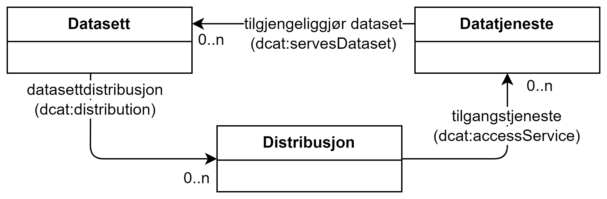

== Spesielt om distribusjoner og datatjenester for datasett med høy verdi [[Spesielt_om_distribusjoner_datatjenester]]

HVD-forordningen krever at datasett med høy verdi skal være tilgjengelig. 

Forordningen setter dessuten eksplisitte krav til om et HVD skal være tilgjengelig som bulknedlasting og/eller via API, avhengig av kategorien datasettet tilhører:

* både via API og som bulknedlasting, f.eks. geodata (jf. Annex 1.2 i forordningen) 
* bare via API, f.eks. "NWP model data" i kategori meteorologiske data (jf. Annex 3.2 i forordningen) 
* enten via API eller som bulknedlasting, f.eks. historiske versjoner av data for jordobservasjon og vær (jf. Annex 2.2 i forordningen)

:xrefstyle: short

[[diagram-datasett-distribusjon-datatjeneste]]
.Datasett, Distribusjon og Datatjeneste.
[link=images/datasett-distribusjon-datatjeneste.png]

<<diagram-datasett-distribusjon-datatjeneste>> illustrerer hvordan bulknedlastinger og API-tilgang skal beskrives: 

:xrefstyle: full

* Bulknedlastinger skal beskrives som **distribusjon**er, ved å bruke egenskapen <<Datasett-datasettdistribusjon>> fra datasettbeskrivelsen. 
** En bulknedlasting kan gjøres tilgjengelig via API, ved å bruke egenskapen https://data.norge.no/specification/dcat-ap-no/#Distribusjon-tilgangstjeneste[Distribusjon – tilgangstjeneste (dcat:accessService) &#x29C9;, window="_blank", role="ext-link"] fra distribusjonsbeskrivelsen. 

* API-tilgang beskrives ved at det i beskrivelsen av det aktuelle APIet (**datatjenesten**) refereres til datasettet ved å bruke egenskapen <<Datatjeneste-tilgjengeliggjor-datasett>>. 
