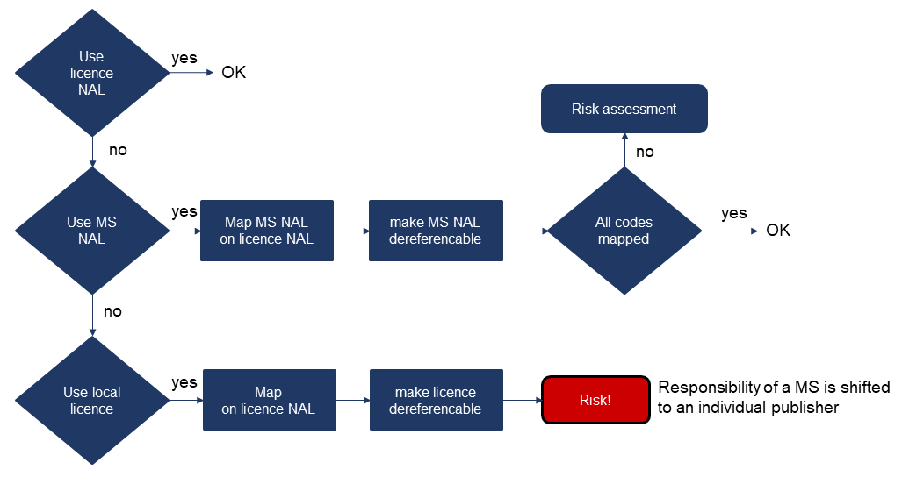
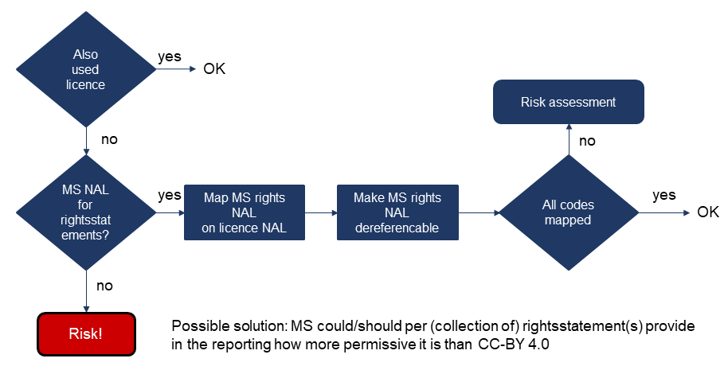

== Spesielt om juridisk informasjon om datasett med høy verdi [[Spesielt_om_juridisk_info]]

__Dette er en forkortet og fornorsket versjon av EUs https://semiceu.github.io/DCAT-AP/releases/2.2.0-hvd/#c3[Legal information &#x29C9;, window="_blank", role="ext-link"] i DCAT-AP HVD.__

HVD-forordningen krever høy metadatakvalitet for juridisk informasjon om datasett med høy verdi. Informasjonen bør være i både maskin- og menneskelesbart format, dessuten med en varig lenke. Videre bør det være mulig å vite om de juridiske betingelsene som er oppgitt, er like eller mer liberale enn https://creativecommons.org/licenses/by/4.0/[CC-BY 4.0 &#x29C9;, window="_blank", role="ext-link"].

Vi anbefaler sterkt at   datautgiverne bruker en av  lisensene fra https://op.europa.eu/en/web/eu-vocabularies/dataset/-/resource?uri=http://publications.europa.eu/resource/dataset/licence[EUs kontrollerte vokabular for lisens &#x29C9;, window="_blank", role="ext-link"], f.eks. CC-BY 4.0 ved å bruke den varige lenken `\http://publications.europa.eu/resource/authority/licence/CC_BY_4_0`.

Katalogeierne anbefales til å evaluere den juridiske informasjonen oppgitt av datasettutgiverne i henhold til flytdiagrammene under, der "licence NAL" refererer til https://op.europa.eu/en/web/eu-vocabularies/dataset/-/resource?uri=http://publications.europa.eu/resource/dataset/licence[EUs kontrollerte vokabular for lisens &#x29C9;, window="_blank", role="ext-link"], og "NAL" står for "Named Authority List" (som vi oversetter til «kontrollert vokabular»).  

:xrefstyle: short

[[diagram-flytdiagram-lisens]]
.Beslutningstre for lisensinformasjon.
[link=images/flow-licenses.png]

[[diagram-flytdiagram-rettigheter]]
.Beslutningstre for rettighetsinformasjon.
[link=images/flow-rights.png]

:xrefstyle: full

Beslutningstrærne ovenfor kan brukes til å evaluere om noe ekstra skal gjøres eller ikke. For å gjøre det mulig for andre å evaluere om de oppgitte betingelsene er like eller mer liberale enn CC-BY 4.0, anbefales det å berike den maskinlesbare publiserte nasjonale eller lokale lisensen med mapping informasjon til ovennevnte EUs kontrollerte vokabular for lisens. Som mapping informasjon anbefales det å bruke, i den rekkefølge, mapping egenskapene i SKOS, `owl:sameAs` eller `rdfs:seeAlso.`  